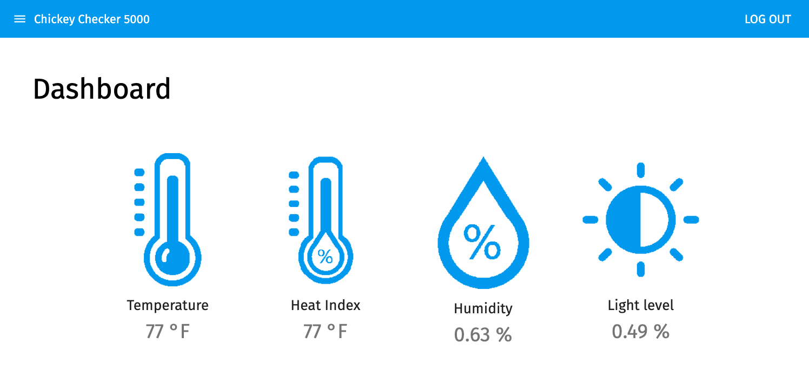
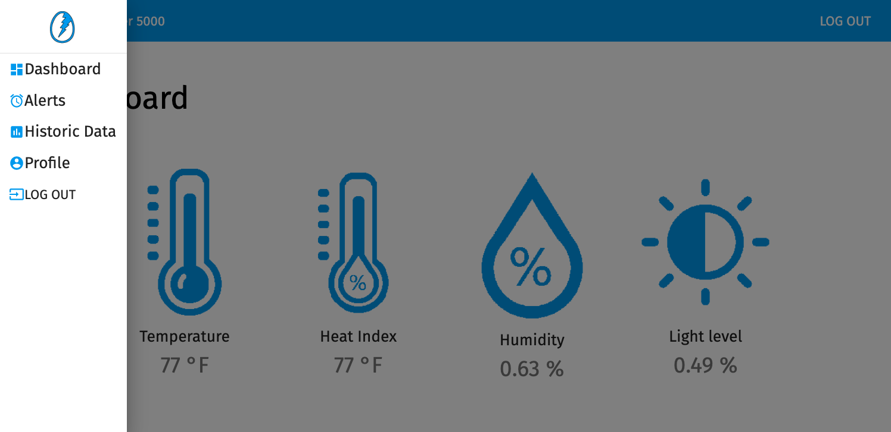
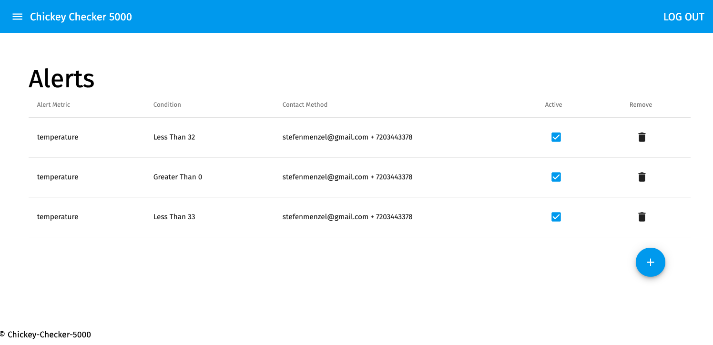
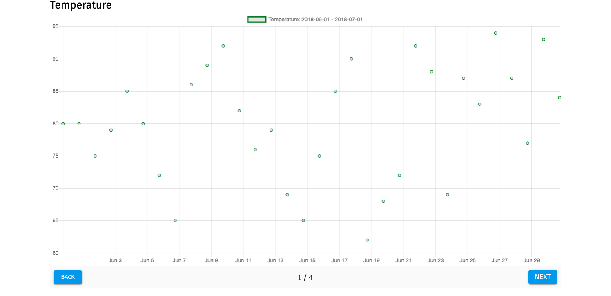

# Chickey Checker 5000

A web-app dashboard that interfaces with an IoT device that monitors conditions inside my chicken coop. In addition to displaying up to date information on the current conditions inside the chicken coop, I've also setup the ability to send text or email alerts when user-defined conditions are met (E.G. the temperature inside the coop has reached below 32 °F) and the ability to visualize historic data. The backend of the webapp pulls information from the particle cloud.

## Built With
This project uses React.js, Redux.js, Redux-Saga, and Material UI for the front-end and Node.js, Express.js and postgreSQL. I used the particle cloud to send out webhooks to my backend in order to retrieve the live information feed. I sent emails using Nodemailer and Gmail and I sent text messages using Twillio.

## Getting Started
To get this project running you'll have to:
• Fork and clone this repo.
• create a postgresql database using the queries in the 'Database.sql' file (table and inserts/alters only)
star:
-You'll want to run a postgreSQL server while using this project
• In the directory you cloned this repo you'll need to run `npm install` to get the dependencies installed for this project.
* once you have your database created and running and you've installed all dependencies, you'll have to run your express server. You should be able to do so by running `npm run server`.
* Once your server is running, you can run the project in a browser by running `npm run client`

## Prerequisites
In order to run this project you'll need to install:

* [node.js](https://nodejs.org/en/) 
* [express.js](https://expressjs.com/)
• [Passport.js](http://www.passportjs.org/)
* [react](https://reactjs.org/) 
* [redux](https://redux.js.org/)
* [saga](https://redux-saga.js.org/)
• [Material-UI](https://material-ui.com/)
• [Nodemailer](https://nodemailer.com/about/)
• [Twilio](https://www.twilio.com/)
* [postgres](https://www.postgresql.org/) and 
* [pg](https://node-postgres.com/)
* All of these can also be installed using NPM (this is my preferred method)
* [NPM](https://www.npmjs.com/)

## Installing
* Download this project.
* install prerequisite libraries listed above.
• run postgreSQL queries and start a postgreSQL database
* run `npm install` from project directory in terminal
* run `npm run server` to start your express server
* run `npm run client` to open this project up in a browser

## Screen Shots

## Completed Features
• Developed all components in React that display on the DOM
• User is able to navigate using a side drawer nav menu
• User is able to set Alerts that are then stored in the database
• All readings come in via a webhook from the particle cloud directly to the backend
• When new readings come in they are checked against the alerts and alerts are sent out if necessary
• User can view historic data from a date range that is then visualized as a graph of sensor readings over time
• User can edit their profile information
• Custom logo :)

## Author
[Stefen Menzel](https://github.com/stefenmenzel)